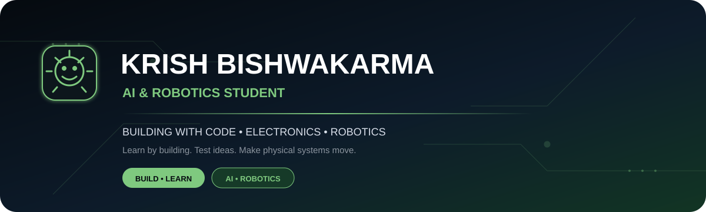
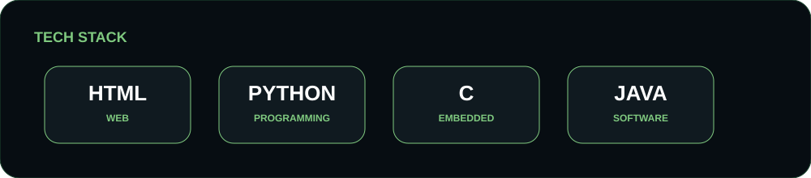
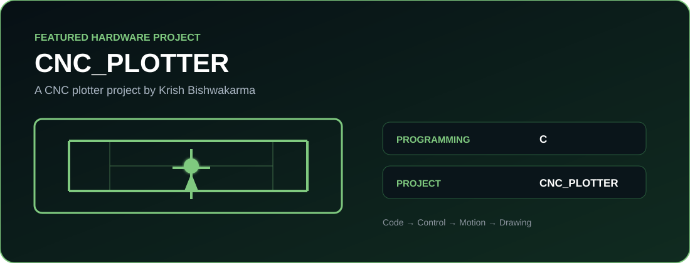
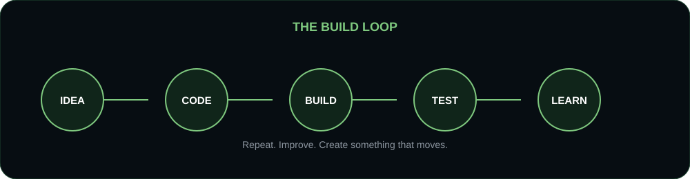
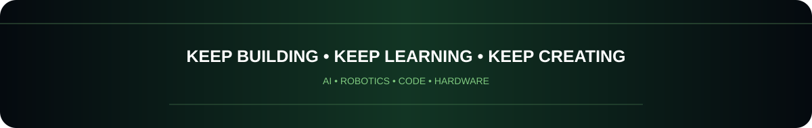

<div align="center">



</div>

<br>

<div align="center">

**AI & Robotics Student • Programmer • Hardware Builder**

`HTML` • `Python` • `C` • `Java`

</div>

---

## 👋 About Me

<table>
<tr>
<td width="58%" valign="top">

### Hi, I'm Krish !
<H1>AI & Robotics Student</H1>

I'm a student interested in **AI, robotics, programming, and hands-on hardware projects**.

I enjoy learning by building — from **code and electronics** to projects that make physical systems move.

```text
BUILD  →  TEST  →  LEARN  →  IMPROVE
   ↑                         ↓
   └──────── BUILD AGAIN ────┘
```

</td>
<td width="42%" valign="top">


<div align="center">
<h1>Developer Snapshot</h1>


<h3>Python  •  C  •  Java  •  HTML</h3> 
 <h3>AI || Robotics || Hardware</h3>


</div>
</td>
</tr>
</table>

---


## 🧰 Tech Stack

<div align="center">



</div>

---

## 🚀 Featured Project

<div align="center">

<a href="https://github.com/bishwakarmakrish1-web/CNC_PLOTTER">

</a>

</div>

### CNC_PLOTTER

A CNC plotter project by Krish Bishwakarma.

**Programming:** `C`  
**Project:** `CNC_PLOTTER`

👉 **[View the CNC_PLOTTER repository](https://github.com/bishwakarmakrish1-web/CNC_PLOTTER)**

---

## 🤖 What I'm Interested In

<div align="center">

| 🤖 Robotics | 🧠 AI | 💻 Programming | ⚡ Electronics | 🛠️ Hardware |
|:---:|:---:|:---:|:---:|:---:|
| Robots & motion | Intelligent systems | Python • C • Java | Circuits & control | Hands-on projects |

</div>

---

## 🎯 The Build Loop

<div align="center">



</div>

---

## 📊 GitHub

<div align="center">

| 📌 Profile | 🔥 Activity | 🚀 Focus |
|:---:|:---:|:---:|
| **GitHub Profile** | **Keep contributing** | **AI + Robotics** |

**[Visit my GitHub profile →](https://github.com/bishwakarmakrish1-web)**

</div>

> **Why no external stats images?**  
> This profile intentionally uses local graphics so the README doesn't turn into a page full of broken-image icons when an external stats/animation service is unavailable.

---

## 🐍 Contribution Snake

The snake animation can be generated and stored directly in this repository using the included GitHub Actions workflow.

After the workflow runs successfully, this section will display the generated animation:

<div align="center">


</div>

---

## 🤝 Connect With Me

<div align="center">

[](https://www.linkedin.com/in/krish-bishwakarma-79719526/)
&nbsp;
[](mailto:bishwakrish@gmail.com)
&nbsp;
[](https://github.com/bishwakarmakrish1-web)

</div>

---

<div align="center">



</div>
